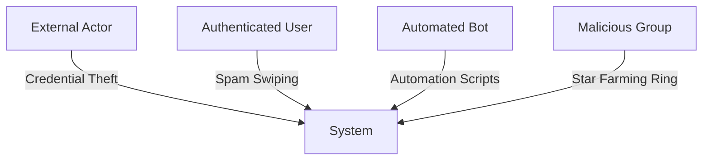
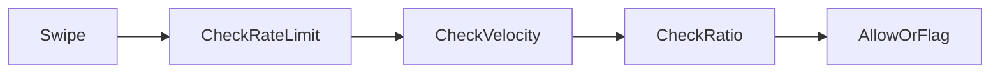
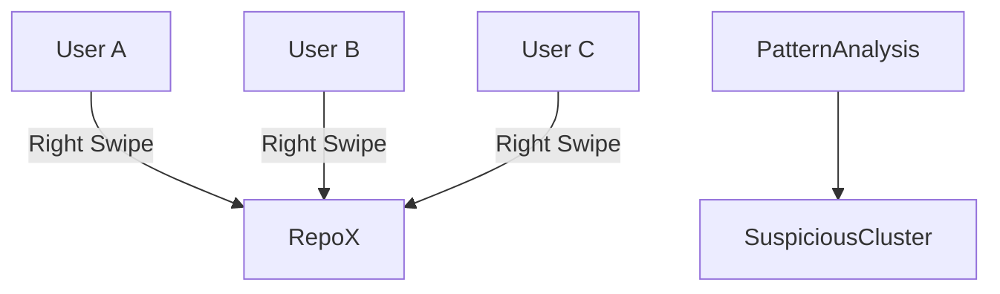
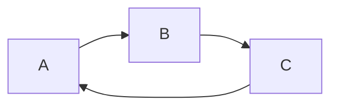

# Starswap Abuse & Threat Model Document

Version: 1.0
Owner: Pratham
Last Updated: 2026-02-27

---

# 1. Overview

Starswap is a reputation-weighted repository discovery platform. Because visibility and score are influenced by user interactions, the system is inherently gameable.

This document identifies:

* Threat categories
* Abuse patterns
* Risk levels
* Detection strategies
* Prevention mechanisms
* Recovery procedures

The goal is to protect fairness, platform integrity, and GitHub API compliance.

---

# 2. Threat Model Summary

Threat surfaces:

* Public API endpoints
* Swipe engine
* Visibility algorithm
* Leaderboard system
* OAuth session layer
* Redis cache layer

---

# 3. Threat Categories

| Category            | Risk Level | Impact                    |
| ------------------- | ---------- | ------------------------- |
| Swipe spam          | High       | Score inflation           |
| Multi-account abuse | High       | Artificial visibility     |
| Star farming rings  | High       | Ecosystem corruption      |
| Timing automation   | Medium     | Algorithm exploitation    |
| API scraping        | Medium     | Data abuse                |
| Session hijacking   | High       | Account takeover          |
| OAuth token leakage | Critical   | GitHub account compromise |

---

# 4. Swipe Spam Patterns

## 4.1 Description

Users attempt to mass right-swipe to increase their visibility score.

## Detection

* Redis counter per user
* Track swipe frequency per minute
* Detect high right-swipe ratio (>90%)
* Detect swipe velocity under human threshold (<150ms intervals)

## Prevention

* Rate limit: 50/hour, 200/day
* Minimum swipe interval threshold
* Logarithmic weighting (diminishing returns)
* Right-swipe cap contribution per day

## Recovery

* Flag account
* Temporarily reduce visibility weight
* Reset suspicious activity score
* Admin review panel

---

# 5. Multi-Account Abuse

## Description

User creates multiple GitHub accounts to boost their own repo.

## Detection

* IP clustering
* Device fingerprint similarity
* Shared interaction patterns
* Identical swipe timing curves
* High reciprocal interaction loops

## Prevention

* GitHub OAuth only (no email signup)
* Minimum account age requirement
* Minimum GitHub activity threshold
* Progressive trust scoring

## Recovery

* Reduce weight of clustered accounts
* Temporary shadow-ban from leaderboard
* Manual review

---

# 6. Star Farming Rings

## Description

Group of users coordinate to inflate each other's repos.

## Detection

* Graph-based analysis
* High bidirectional interaction density
* Closed loop engagement clusters
* Abnormal mutual swipe frequency

## Prevention

* Weight mutual interactions lower
* Cap reciprocal influence
* Diversity requirement in scoring

## Recovery

* Nullify suspicious interaction weight
* Notify users
* Restrict ranking eligibility

---

# 7. Timing Pattern Automation

## Description

Bots simulate swipe patterns with consistent intervals.

## Detection

* Measure variance in swipe timing
* Detect fixed interval automation
* Behavioral anomaly scoring

## Prevention

* Introduce slight server-side randomness
* CAPTCHA after suspicious burst
* Progressive cooldown

## Recovery

* Temporary suspension
* Activity audit

---

# 8. API Scraping

## Description

External actors scrape feed data for analytics or resale.

## Detection

* IP rate spikes
* Unauthenticated access attempts
* Abnormal pagination traversal

## Prevention

* Strict rate limiting
* Require authentication
* Cursor-based pagination
* Bot detection via headers

## Recovery

* IP blocking
* Temporary API key bans (if introduced)

---

# 9. Session Hijacking

## Description

Attacker steals session cookie to impersonate user.

## Detection

* Session IP change anomaly
* Device mismatch
* Concurrent geographic sessions

## Prevention

* Secure httpOnly cookies
* SameSite=strict
* Short session TTL
* Token rotation

## Recovery

* Force logout all sessions
* Invalidate session tokens
* Alert user

---

# 10. OAuth Token Leakage

## Description

Exposure of GitHub access token via logs or client-side leak.

## Detection

* Log scanning for tokens
* Unexpected GitHub API usage spikes

## Prevention

* Never expose token to frontend
* Encrypt at rest
* Use minimal scopes
* Store in secure environment variables

## Recovery

* Revoke token via GitHub
* Force re-authentication
* Audit access logs

---

# 11. Abuse Scoring System

Each user assigned a dynamic abuse risk score.

Factors:

* Swipe frequency anomalies
* Right-swipe ratio
* Cluster similarity
* IP volatility
* Session anomalies

Score thresholds:

| Score | Action                   |
| ----- | ------------------------ |
| 0-30  | Normal                   |
| 31-60 | Soft flag                |
| 61-80 | Shadow reduce visibility |
| 81+   | Temporary suspension     |

---

# 12. Monitoring & Alerting

Metrics tracked:

* Suspicious swipe rate
* Cluster detection events
* API abuse attempts
* Session anomaly count

Alerts triggered when:

* Abuse rate > 5% daily
* GitHub API errors spike
* Leaderboard volatility anomaly

---

# 13. Recovery Playbooks

## Account Compromise

* Invalidate sessions
* Revoke GitHub token
* Notify user
* Force password reset (GitHub side)

## Abuse Cluster

* Temporarily remove leaderboard impact
* Run graph recalculation
* Manual moderation review

## System Exploit

* Disable vulnerable endpoint
* Deploy hotfix
* Audit logs

---

# 14. Compliance & Ethics

* No automated starring
* No artificial GitHub metric manipulation
* Full transparency in scoring mechanics
* Respect GitHub API rate limits

---

# 15. Future Enhancements

* ML anomaly detection model
* Graph neural network cluster detection
* Dedicated moderation dashboard
* Reputation decay system

---

# 16. Conclusion

Starswap's integrity depends on structured interaction fairness. Abuse prevention must operate at behavioral, architectural, and algorithmic levels simultaneously. Continuous monitoring and adaptive controls are required to maintain ecosystem trust.

---

END OF DOCUMENT
