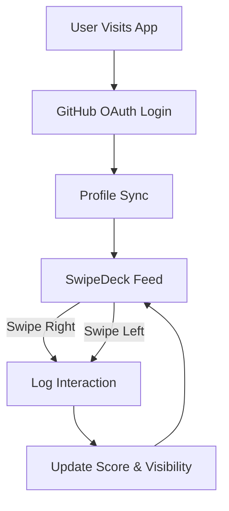
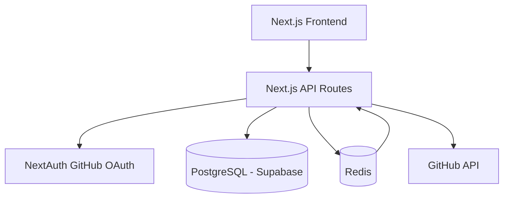
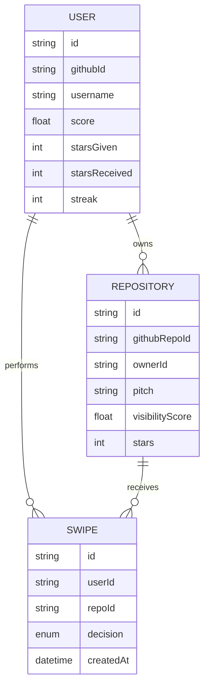
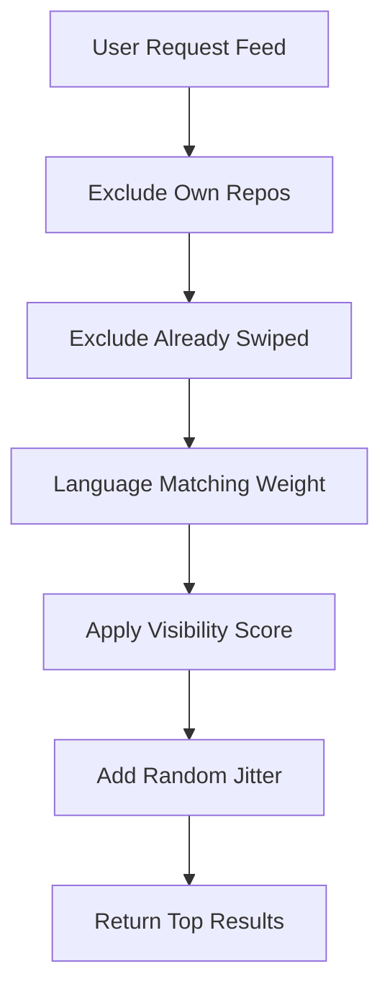
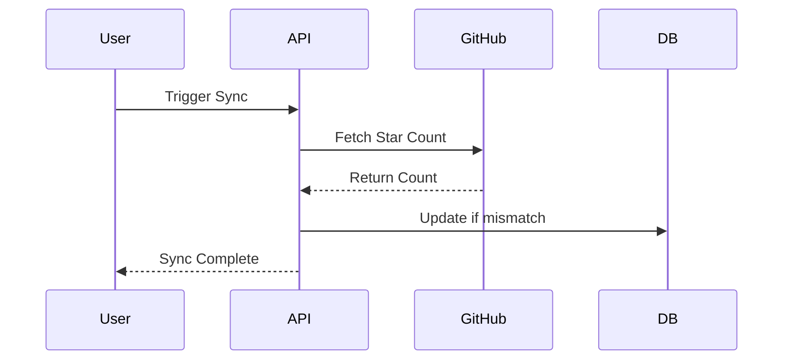

# Starswap Product Requirements Document (PRD)

Version: 1.0
Owner: Pratham
Status: Draft
Last Updated: 2026-02-27

---

# 1. Executive Summary

Starswap is a swipe-based repository discovery platform that helps developers discover relevant GitHub repositories through sequential interactions. Instead of bulk browsing or star trading, Starswap enforces one-decision-at-a-time interactions to promote fairness, discovery quality, and abuse resistance.

The platform uses GitHub OAuth for authentication, Prisma ORM with PostgreSQL (Supabase) for persistence, and Redis for caching, rate limiting, and abuse prevention.

Core idea:

> Engagement increases visibility. Discovery is algorithmic, not manual.

---

# 2. Problem Statement

## 2.1 Current Problems

* Repository discovery on GitHub is noisy and biased toward already-popular projects.
* Small developers struggle with visibility.
* Star exchanges and bots create artificial engagement.
* Bulk actions are easy to game.

## 2.2 Opportunity

Create a structured, sequential decision interface that:

* Encourages real discovery
* Rewards consistent engagement
* Prevents star-spam behavior
* Builds a fair visibility engine

---

# 3. Goals & Non-Goals

## 3.1 Goals

* Provide swipe-based repository discovery
* Enforce sequential decisions
* Implement activity-weighted visibility scoring
* Prevent artificial star inflation
* Deliver low-latency interactions
* Support leaderboard & streak systems

## 3.2 Non-Goals

* Automating GitHub stars
* Manipulating GitHub metrics
* Acting as a star-trading platform
* Replacing GitHub search

---

# 4. Target Users

## Primary Users

* Indie developers
* Open-source maintainers
* Students seeking visibility

## Secondary Users

* Dev tool creators
* Hackathon participants
* Early-stage SaaS builders

---

# 5. User Flow



---

# 6. System Architecture

## 6.1 High-Level Architecture



---

# 7. Technical Stack

## Frontend

* Next.js (App Router)
* Tailwind CSS
* Framer Motion (Swipe animations)
* React Query (Server state)
* Zustand (Local UI state)

## Backend

* Next.js Route Handlers
* Prisma ORM
* PostgreSQL (Supabase)
* Redis (Upstash)

## Infrastructure

* Vercel Deployment
* Supabase Managed DB
* Upstash Redis

---

# 8. Database Schema (Conceptual)



---

# 9. Core Features

## 9.1 Authentication

* GitHub OAuth via NextAuth
* Secure session management
* Role-based access (User / Pro / Admin)

## 9.2 SwipeDeck

* One repo per decision
* Animated card transitions
* Optimistic UI updates

## 9.3 Repository Submission

* Pitch (180 character limit)
* Auto-fetch GitHub metadata
* Language detection

## 9.4 Visibility Engine

Visibility score calculated from:

* Stars Given (log weighted)
* Stars Received (log weighted)
* Streak multiplier
* Recent activity boost

Example:

```
score = log(starsGiven + 1) * 0.4
      + log(starsReceived + 1) * 0.6
      + streak * 0.3
```

---

# 10. Feed Ranking Logic



Ranking factors:

* Language overlap
* Visibility score
* Recent activity
* Controlled randomness

---

# 11. Redis Usage

## 11.1 API Caching

* GitHub repo data
* TTL: 10 minutes

## 11.2 Rate Limiting

* 50 swipes/hour
* 200/day

## 11.3 Abuse Prevention

* Detect rapid sequential swipes
* Flag 100% right-swipe patterns
* Track suspicious timing intervals

---

# 12. Sync Engine

## Manual Sync

* User-triggered
* Validates GitHub star count
* Debounced per repo

## Automatic Sync

* Background cron every 5 minutes
* Prioritize active repositories



---

# 13. Leaderboard System

Weighted score ranking based on:

* Activity consistency
* Stars received
* Engagement frequency

Leaderboard views:

* Weekly
* Monthly
* All-time

---

# 14. Streak System

Rules:

* At least 1 swipe/day
* Break resets streak
* Bonus multiplier for consistency

---

# 15. Security & Abuse Mitigation

* Rate limiting via Redis
* Sequential interaction enforcement
* No auto-starring
* Periodic validation against GitHub API
* Role-based moderation

---

# 16. Performance Requirements

* Feed response time < 200ms
* Swipe latency < 100ms
* 99.9% uptime target
* Redis cache hit rate > 70%

---

# 17. Observability

* Structured logging
* Error tracking
* Rate-limit alerts
* Abuse detection dashboard

---

# 18. Beta Features

* Floating bug report widget
* Severity tagging
* Admin dashboard for review

---

# 19. Monetization (Future)

* Pro tier perks
* Highlighted repository boost
* Advanced analytics

---

# 20. Deployment Strategy

## Environments

* Development
* Staging
* Production

## CI/CD

* GitHub Actions
* Automatic lint + type check
* Database migration pipeline

---

# 21. Risks & Mitigations

| Risk                   | Mitigation               |
| ---------------------- | ------------------------ |
| GitHub API rate limits | Redis caching + batching |
| Star farming behavior  | Log weighting + caps     |
| Bot attacks            | Behavioral detection     |
| Low retention          | Streak incentives        |

---

# 22. Future Roadmap

Phase 1: Core swipe MVP
Phase 2: Abuse resistance
Phase 3: Gamification
Phase 4: Advanced discovery
Phase 5: Open-source release

---

# 23. Success Metrics

* Daily active users
* Average swipes per session
* Retention (7-day)
* Organic GitHub star validation rate
* Abuse rate < 1%

---

# 24. Conclusion

Starswap is not a star exchange system. It is a discovery engine built on structured interaction mechanics and visibility-weighted reputation scoring. The platform prioritizes fairness, performance, and long-term ecosystem growth over artificial engagement.

---

END OF DOCUMENT
