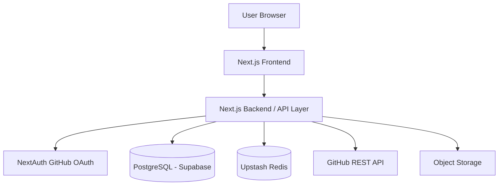
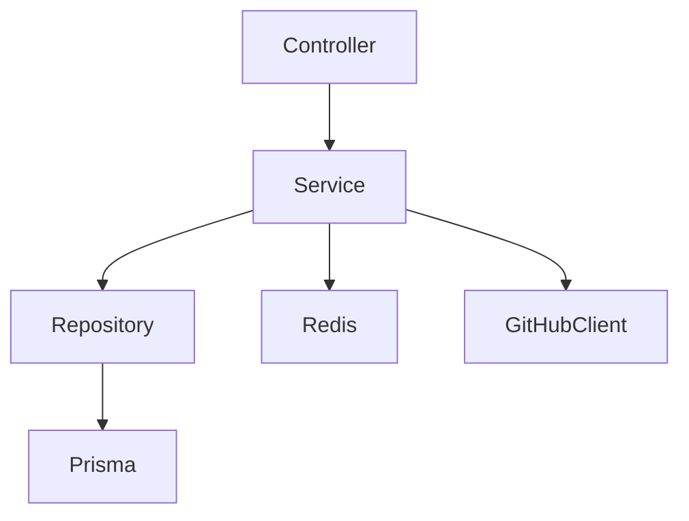
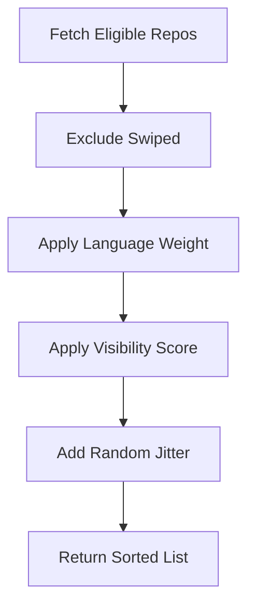
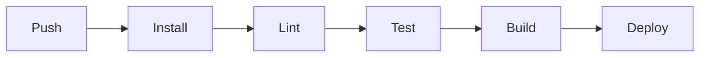

# Starswap Technical Architecture Document

Version: 1.0
Owner: Pratham
Last Updated: 2026-02-27

---

# 1. Overview

This document defines the complete technical architecture for Starswap, a swipe-based repository discovery platform built on top of GitHub.

It covers:

* System architecture
* Tech stack
* Backend services
* Frontend architecture
* Database design
* API contracts
* Redis strategy
* Dockerization
* CI/CD
* Deployment
* Infrastructure
* Observability
* Security

---

# 2. High-Level Architecture



---

# 3. Tech Stack

## 3.1 Frontend

* Next.js (App Router)
* TypeScript
* Tailwind CSS
* Framer Motion (Swipe animations)
* React Query (Server state)
* Zustand (Client state)
* Axios (API layer)

## 3.2 Backend

* Next.js Route Handlers
* Prisma ORM
* PostgreSQL (Supabase)
* Redis (Upstash)
* NextAuth (GitHub OAuth)

## 3.3 Infrastructure

* Vercel (Frontend + API hosting)
* Supabase (Managed PostgreSQL)
* Upstash (Managed Redis)
* GitHub Actions (CI/CD)
* Docker (Local dev + production container option)

---

# 4. Backend Architecture

## 4.1 Layered Design



Layers:

* Controllers (Route Handlers)
* Services (Business logic)
* Repository layer (DB access)
* External API clients

---

# 5. Database Design

Primary tables:

* Users
* Repositories
* Swipes
* Sessions
* LeaderboardSnapshots

Indexes:

* userId + repoId unique composite
* visibilityScore index
* createdAt descending index

Connection pooling handled via Supabase.

---

# 6. API Design

Base URL:

```
/api
```

## 6.1 Authentication

GET /api/auth/session
POST /api/auth/signin
POST /api/auth/signout

---

## 6.2 Feed

GET /api/feed

Response:

```
{
  id,
  name,
  pitch,
  languages,
  stars,
  visibilityScore
}
```

---

## 6.3 Swipe

POST /api/swipe

Request:

```
{
  repoId,
  decision: "LEFT" | "RIGHT"
}
```

---

## 6.4 Repository Submission

POST /api/repository/submit

---

## 6.5 Sync

POST /api/repository/sync

---

## 6.6 Leaderboard

GET /api/leaderboard?period=weekly

---

# 7. Feed Ranking Logic



Score formula:

score = log(starsGiven+1)*0.4
+ log(starsReceived+1)*0.6
+ streak*0.3

---

# 8. Redis Strategy

## 8.1 Caching

Key format:

repo:{repoId}

TTL: 600 seconds

---

## 8.2 Rate Limiting

Key:

rate:{userId}

Limits:

* 50 swipes/hour
* 200/day

---

## 8.3 Abuse Detection

Track:

* Swipe frequency
* Swipe timing patterns
* Right-swipe ratio

---

# 9. Frontend Architecture

## 9.1 Folder Structure

```
/app
  /feed
  /leaderboard
  /submit
  /profile
/components
  SwipeCard.tsx
  SwipeDeck.tsx
/lib
  api.ts
  auth.ts
  store.ts
```

---

## 9.2 State Management

* React Query → server data
* Zustand → local swipe stack

---

# 10. Dockerization

## 10.1 Dockerfile

* Base: node:18-alpine
* Install dependencies
* Build Next.js
* Expose port 3000
* Run production server

---

## 10.2 docker-compose.yml

Services:

* app
* postgres (local dev only)
* redis (local dev only)

---

# 11. CI/CD Pipeline

## 11.1 GitHub Actions Workflow

Steps:

1. Install dependencies
2. Run ESLint
3. Run Type check
4. Run Tests
5. Build project
6. Run Prisma migrations
7. Deploy to Vercel



---

# 12. Deployment Strategy

## Environments

* Development
* Staging
* Production

Secrets managed via:

* Vercel environment variables
* Supabase secrets
* GitHub Secrets

---

# 13. Observability

* Structured logging
* Request tracing
* Error tracking integration
* Redis monitoring
* Database slow query monitoring

---

# 14. Security

* HTTPS enforced
* Secure cookies
* CSRF protection
* Input validation
* Rate limiting
* GitHub token encryption

---

# 15. Scalability Plan

Phase 1: Single region deployment
Phase 2: Redis sharding
Phase 3: Read replicas
Phase 4: Background worker queue

---

# 16. Background Jobs

Future queue service:

* Star sync jobs
* Leaderboard recalculation
* Activity snapshot generation

---

# 17. Performance Targets

* API latency < 200ms
* Swipe response < 100ms
* Redis hit rate > 70%
* P95 latency < 300ms

---

# 18. Disaster Recovery

* Daily DB backups (Supabase)
* Environment version control
* Rollback via Vercel deployment history

---

# 19. Future Enhancements

* AI-based repo tagging
* Personalized feed ML model
* Contributor matching
* GraphQL API layer

---

# 20. Conclusion

This technical architecture ensures Starswap is scalable, secure, abuse-resistant, and production-ready while maintaining low-latency interactions and structured discovery mechanics.

---

END OF DOCUMENT
